# Design Document: Virtual CIO System

## Overview

The Virtual CIO System is an AI-powered intelligent platform that unifies natural language data intelligence with comprehensive financial automation. The system combines three revolutionary capabilities:

1. **Reactive Mode (NL2SQL)**: Natural language query interface that converts plain English questions into SQL queries, executes them, and returns results with AI-generated insights and visualizations
2. **Proactive Mode (Sentinel Agent)**: Autonomous AI agent that continuously brainstorms and executes monitoring missions to detect threats, anomalies, and opportunities across multiple domains
3. **Financial Automation**: Comprehensive financial operations including transaction processing, portfolio management, risk assessment, compliance monitoring, and strategic advisory

The architecture is built on a multi-agent orchestration framework using LangGraph, with specialized agents for different capabilities. The system operates as a true Virtual CIO, providing both reactive intelligence (answering questions) and proactive intelligence (autonomous monitoring), while automating routine financial operations and providing strategic recommendations.

### Key Design Principles

1. **AI-First Architecture**: LLMs are central to every capability, from query understanding to insight generation
2. **Multi-Agent Orchestration**: LangGraph coordinates complex workflows across specialized agents
3. **Domain Expertise**: Specialized prompts and few-shot examples for different intelligence domains
4. **Self-Healing**: Automatic error detection and repair for SQL queries and system operations
5. **Proactive Intelligence**: Autonomous monitoring without human intervention
6. **Executive Focus**: Every output includes strategic insights and actionable recommendations
7. **Scalability**: Event-driven architecture supporting horizontal scaling
8. **Security-First**: Defense-in-depth with encryption, authentication, and comprehensive audit trails

## Architecture

The system follows a layered, event-driven architecture with LangGraph orchestration at its core:

```mermaid
graph TB
    subgraph "Presentation Layer"
        ChatUI[Chat Interface<br/>Reactive Mode]
        SentinelUI[Sentinel Dashboard<br/>Proactive Mode]
        FinDash[Financial Dashboard]
        API[REST API]
    end
    
    subgraph "LangGraph Orchestration Layer"
        ReactiveGraph[Reactive Workflow<br/>Intent→SQL→Execute→Insights]
        ProactiveGraph[Proactive Workflow<br/>Brainstorm→Missions→Detect]
        FinancialGraph[Financial Workflow<br/>Validate→Execute→Monitor]
    end
    
    subgraph "AI Agent Layer"
        IntentAgent[Intent Classifier]
        SQLAgent[SQL Generator]
        ValidatorAgent[SQL Validator]
        RepairAgent[SQL Repair Agent]
        InsightAgent[Insight Generator]
        VizAgent[Visualization Recommender]
        SentinelBrain[Sentinel Brainstormer]
        AdvisoryAgent[Advisory Engine]
        RiskAgent[Risk Analyzer]
    end
    
    subgraph "Service Layer"
        DataSync[Data Sync Service]
        TxnProc[Transaction Processor]
        Portfolio[Portfolio Manager]
        Compliance[Compliance Monitor]
        Market[Market Intelligence]
        Budget[Budget Forecaster]
        Notify[Notification Service]
        Analytics[Analytics Engine]
    end
    
    subgraph "Data Layer"
        PrimaryDB[(Primary Database<br/>PostgreSQL)]
        TimeSeriesDB[(Time Series DB<br/>InfluxDB)]
        DocStore[(Document Store<br/>MongoDB)]
        Cache[(Redis Cache)]
        AuditLog[(Audit Log<br/>Immutable)]
    end
    
    subgraph "External Systems"
        Banks[Banking APIs]
        Accounting[Accounting Systems]
        Investments[Investment Platforms]
        MarketData[Market Data Providers]
    end
    
    subgraph "LLM Layer"
        Bedrock[Amazon Bedrock<br/>Gemini 2.5 Flash]
    end
    
    ChatUI --> API
    SentinelUI --> API
    FinDash --> API
    
    API --> ReactiveGraph
    API --> ProactiveGraph
    API --> FinancialGraph
    
    ReactiveGraph --> IntentAgent
    ReactiveGraph --> SQLAgent
    ReactiveGraph --> ValidatorAgent
    ReactiveGraph --> RepairAgent
    ReactiveGraph --> InsightAgent
    ReactiveGraph --> VizAgent
    
    ProactiveGraph --> SentinelBrain
    ProactiveGraph --> SQLAgent
    ProactiveGraph --> InsightAgent
    
    FinancialGraph --> AdvisoryAgent
    FinancialGraph --> RiskAgent
    FinancialGraph --> TxnProc
    FinancialGraph --> Portfolio
    FinancialGraph --> Compliance
    
    IntentAgent --> Bedrock
    SQLAgent --> Bedrock
    RepairAgent --> Bedrock
    InsightAgent --> Bedrock
    VizAgent --> Bedrock
    SentinelBrain --> Bedrock
    AdvisoryAgent --> Bedrock
    RiskAgent --> Bedrock
    
    SQLAgent --> PrimaryDB
    ValidatorAgent --> PrimaryDB
    DataSync --> PrimaryDB
    TxnProc --> PrimaryDB
    Portfolio --> TimeSeriesDB
    Market --> Cache
    
    DataSync --> Banks
    DataSync --> Accounting
    TxnProc --> Banks
    TxnProc --> Investments
    Market --> MarketData
    
    ReactiveGraph --> AuditLog
    ProactiveGraph --> AuditLog
    TxnProc --> AuditLog
    Compliance --> AuditLog
    
    AdvisoryAgent --> DocStore
    SentinelBrain --> DocStore
```



### Architecture Layers

**Presentation Layer**: User interfaces for different modes (chat, sentinel dashboard, financial dashboard) and REST API

**LangGraph Orchestration Layer**: Three main workflow graphs coordinating multi-agent processes

**AI Agent Layer**: Specialized LLM-powered agents for different capabilities

**Service Layer**: Business logic services for financial operations

**Data Layer**: Multi-database strategy for different data types

**External Systems**: Integration with banking, accounting, investment, and market data providers

**LLM Layer**: Centralized LLM access via Amazon Bedrock


## Components and Interfaces

### 1. LangGraph Reactive Workflow (NL2SQL)

**Responsibility**: Orchestrate the natural language query pipeline from intent classification to insight delivery

**Workflow States**:
```python
class ReactiveState(TypedDict):
    user_query: str
    conversation_history: list[Message]
    domain: str  # Security, Risk, Compliance, Operations, Financial
    sql_query: str
    validation_result: ValidationResult
    query_results: list[dict]
    insights: str
    visualization_config: VisualizationConfig
    error: Optional[str]
    retry_count: int
```

**Workflow Graph**:
```
START → classify_intent → generate_sql → validate_sql → 
  ├─ [valid] → execute_query → parallel_process → END
  │                              ├─ generate_insights
  │                              └─ recommend_visualization
  └─ [invalid] → repair_sql → validate_sql (loop max 3 times)
```

**Key Operations**:
- `classify_intent(state) -> state`: Determine domain and intent using LLM (temp 0.0)
- `generate_sql(state) -> state`: Create SQL using domain-specific prompts and few-shot examples
- `validate_sql(state) -> state`: Check SQL syntax and semantics
- `repair_sql(state) -> state`: Fix SQL errors using LLM analysis
- `execute_query(state) -> state`: Run SQL against database
- `generate_insights(state) -> state`: Create strategic insights (temp 0.3)
- `recommend_visualization(state) -> state`: Select chart type and configuration

**Configuration**:
- Max retry attempts: 3
- LLM temperature: 0.0 for classification/SQL, 0.3 for insights
- Timeout: 3 seconds end-to-end
- Cache TTL: 300 seconds for query results

### 2. LangGraph Proactive Workflow (Sentinel Agent)

**Responsibility**: Autonomously generate and execute monitoring missions to detect threats and anomalies

**Workflow States**:
```python
class ProactiveState(TypedDict):
    mission_cycle_id: str
    database_schema: dict
    domains: list[str]  # Security, Risk, Compliance, Operations, Financial
    missions: list[Mission]
    mission_results: list[MissionResult]
    alerts: list[Alert]
    timestamp: datetime
```

**Mission Structure**:
```python
class Mission(TypedDict):
    mission_id: str
    domain: str
    audit_question: str
    sql_query: str
    expected_finding_type: str  # anomaly, violation, risk, opportunity
    severity_threshold: str  # INFO, WARNING, CRITICAL
```

**Workflow Graph**:
```
START → brainstorm_missions → execute_missions_parallel →
  ├─ mission_1: generate_sql → execute → analyze_results → create_alert
  ├─ mission_2: generate_sql → execute → analyze_results → create_alert
  ├─ mission_3: generate_sql → execute → analyze_results → create_alert
  ├─ mission_4: generate_sql → execute → analyze_results → create_alert
  ├─ mission_5: generate_sql → execute → analyze_results → create_alert
  └─ mission_6: generate_sql → execute → analyze_results → create_alert
→ aggregate_findings → generate_summary_report → END
```

**Key Operations**:
- `brainstorm_missions(state) -> state`: Generate 6 missions (2 per domain) using LLM (temp 0.8)
- `execute_mission(mission) -> MissionResult`: Run mission SQL and analyze results
- `analyze_results(mission, results) -> Alert`: Detect anomalies and create alerts
- `aggregate_findings(state) -> state`: Combine all mission results
- `generate_summary_report(state) -> state`: Create executive summary

**Configuration**:
- Missions per cycle: 6 (2 per primary domain)
- LLM temperature: 0.8 for brainstorming, 0.0 for SQL generation
- Cycle interval: Configurable (default 15 minutes)
- Parallel execution: All 6 missions run concurrently

### 3. LangGraph Financial Workflow

**Responsibility**: Orchestrate financial operations including transactions, portfolio management, and advisory

**Workflow States**:
```python
class FinancialState(TypedDict):
    operation_type: str  # transaction, portfolio_analysis, risk_assessment, advisory
    transaction: Optional[Transaction]
    portfolio: Optional[Portfolio]
    risk_assessment: Optional[RiskAssessment]
    compliance_check: ComplianceResult
    market_context: MarketData
    recommendations: list[Recommendation]
    alerts: list[Alert]
```

**Workflow Graph**:
```
START → validate_operation → check_compliance →
  ├─ [transaction] → verify_funds → execute_transaction → audit_log → notify
  ├─ [portfolio] → calculate_metrics → assess_risk → generate_recommendations
  ├─ [risk] → evaluate_portfolio → scenario_analysis → generate_alerts
  └─ [advisory] → analyze_market → generate_insights → create_report
→ END
```

**Key Operations**:
- `validate_operation(state) -> state`: Validate input data and permissions
- `check_compliance(state) -> state`: Verify against compliance rules
- `execute_transaction(state) -> state`: Process financial transaction
- `calculate_metrics(state) -> state`: Compute portfolio performance metrics
- `assess_risk(state) -> state`: Evaluate risk exposure
- `generate_recommendations(state) -> state`: Create strategic recommendations


### 4. Intent Classification Agent

**Responsibility**: Classify user queries into domains and intents

**Key Operations**:
- `classify(query, conversation_history) -> Classification`: Determine domain and intent

**Data Structures**:
```python
class Classification(TypedDict):
    domain: str  # Security, Risk, Compliance, Operations, Financial
    intent: str  # query_data, analyze_trend, compare_metrics, etc.
    confidence: float
    entities: list[str]  # Extracted entities (dates, amounts, names)
```

**Prompt Strategy**:
- Use structured output format (JSON)
- Include domain descriptions and examples
- Temperature: 0.0 for deterministic classification
- Few-shot examples for each domain

**Domain Definitions**:
- **Security & Risk**: Authentication, authorization, threats, vulnerabilities, suspicious activity
- **Compliance**: Regulatory requirements, policy violations, audit trails, reporting
- **Operations**: System performance, transaction volumes, user activity, service health
- **Financial**: Portfolio performance, transactions, budgets, cash flow, investments, market analysis

### 5. SQL Generation Agent

**Responsibility**: Generate valid SQL queries from natural language using domain-specific knowledge

**Key Operations**:
- `generate_sql(query, domain, schema, few_shot_examples) -> SQLQuery`: Create SQL query

**Data Structures**:
```python
class SQLQuery(TypedDict):
    sql: str
    explanation: str
    tables_used: list[str]
    estimated_complexity: str  # simple, moderate, complex
```

**Prompt Strategy**:
- Domain-specific system prompts
- Include database schema with table/column descriptions
- Few-shot examples for common query patterns
- Temperature: 0.0 for deterministic generation
- Explicit instructions for SQL dialect (PostgreSQL, MySQL, etc.)

**Few-Shot Example Structure**:
```python
class FewShotExample(TypedDict):
    natural_language: str
    sql_query: str
    explanation: str
    domain: str
```

**Domain Configuration Files**:
- `security.json`: Schema + examples for security queries
- `risk.json`: Schema + examples for risk queries
- `compliance.json`: Schema + examples for compliance queries
- `operations.json`: Schema + examples for operational queries
- `financial.json`: Schema + examples for financial queries

### 6. SQL Validator Agent

**Responsibility**: Validate SQL syntax and semantics before execution

**Key Operations**:
- `validate(sql, schema) -> ValidationResult`: Check SQL validity

**Data Structures**:
```python
class ValidationResult(TypedDict):
    is_valid: bool
    errors: list[ValidationError]
    warnings: list[str]
    tables_accessed: list[str]
    estimated_rows: Optional[int]
```

**Validation Checks**:
1. **Syntax Validation**: Parse SQL using sqlparse library
2. **Schema Validation**: Verify tables and columns exist
3. **Permission Validation**: Check user has access to tables
4. **Safety Validation**: Detect dangerous operations (DROP, DELETE without WHERE)
5. **Performance Validation**: Warn about missing indexes or full table scans

### 7. SQL Repair Agent

**Responsibility**: Automatically fix SQL errors using LLM analysis

**Key Operations**:
- `repair(failed_sql, error_message, schema) -> SQLQuery`: Generate repaired SQL

**Data Structures**:
```python
class RepairResult(TypedDict):
    repaired_sql: str
    changes_made: list[str]
    confidence: float
    explanation: str
```

**Repair Strategy**:
1. Analyze error message to identify root cause
2. Reference schema to find correct table/column names
3. Generate repaired SQL with explanation
4. Temperature: 0.0 for deterministic repair
5. Max 3 repair attempts per query

**Common Error Patterns**:
- Column not found → Check schema for similar column names
- Table not found → Check schema for similar table names
- Syntax error → Fix SQL syntax based on dialect
- Ambiguous column → Add table qualifiers
- Type mismatch → Add appropriate type casts

### 8. Insight Generation Agent

**Responsibility**: Generate strategic insights and recommendations from query results

**Key Operations**:
- `generate_insights(query, results, domain, context) -> Insights`: Create executive intelligence

**Data Structures**:
```python
class Insights(TypedDict):
    executive_summary: str
    key_findings: list[str]
    strategic_implications: list[str]
    recommendations: list[Recommendation]
    risk_score: Optional[float]
    priority: str  # LOW, MEDIUM, HIGH, URGENT
```

**Prompt Strategy**:
- Include query context and domain
- Provide result data with statistics
- Request specific format: findings → implications → recommendations
- Temperature: 0.3 for balanced creativity and accuracy
- Emphasize actionable recommendations

**Insight Components**:
1. **Executive Summary**: 2-3 sentence overview
2. **Key Findings**: Bullet points of important data points
3. **Strategic Implications**: Why this matters for the business
4. **Recommendations**: Specific actions to take
5. **Risk Assessment**: Quantified risk score if applicable

### 9. Visualization Recommender Agent

**Responsibility**: Select appropriate chart types and generate visualization configurations

**Key Operations**:
- `recommend_visualization(query, results, data_types) -> VisualizationConfig`: Choose chart type

**Data Structures**:
```python
class VisualizationConfig(TypedDict):
    chart_type: str  # bar, line, pie, scatter, table, heatmap
    x_axis: str
    y_axis: str
    series: list[str]
    title: str
    color_scheme: str
    options: dict  # Chart-specific options
```

**Chart Selection Logic**:
- **Bar Chart**: Comparing categories, discrete values
- **Line Chart**: Time series, trends over time
- **Pie Chart**: Proportions, percentages (max 7 categories)
- **Scatter Plot**: Correlation between two variables
- **Table**: Detailed data, many columns
- **Heatmap**: Matrix data, correlation matrices

**Visualization Best Practices**:
- Limit pie charts to 7 categories
- Use line charts for time series
- Sort bar charts by value (descending)
- Include clear axis labels and titles
- Use colorblind-friendly palettes


### 10. Sentinel Brainstormer Agent

**Responsibility**: Autonomously generate creative monitoring missions across domains

**Key Operations**:
- `brainstorm_missions(schema, domains, previous_missions) -> list[Mission]`: Generate 6 missions

**Data Structures**:
```python
class Mission(TypedDict):
    mission_id: str
    domain: str
    audit_question: str  # Natural language description
    rationale: str  # Why this mission is important
    expected_finding_type: str  # anomaly, violation, risk, opportunity
    severity_threshold: str  # INFO, WARNING, CRITICAL
```

**Prompt Strategy**:
- Temperature: 0.8 for creative diversity
- Include database schema for context
- Request 2 missions per domain (Security, Compliance, Financial)
- Emphasize proactive threat detection
- Avoid repeating recent missions

**Mission Categories**:
1. **Security Missions**: Failed logins, unauthorized access, suspicious patterns
2. **Compliance Missions**: Policy violations, missing documentation, regulatory gaps
3. **Financial Missions**: Budget overruns, unusual transactions, portfolio risks

**Mission Quality Criteria**:
- Specific and actionable
- Measurable with SQL query
- Relevant to business operations
- Diverse across domains
- Not duplicating recent missions

### 11. Transaction Processor Service

**Responsibility**: Execute and manage financial transactions with validation and error handling

**Key Operations**:
- `schedule_transaction(transaction, schedule) -> TransactionID`: Schedule future transaction
- `execute_transaction(transaction) -> ExecutionResult`: Execute transaction immediately
- `verify_funds(account, amount) -> bool`: Check fund availability
- `request_approval(transaction, approvers) -> ApprovalRequest`: Request manual approval
- `rollback_transaction(transaction_id) -> RollbackResult`: Reverse completed transaction

**Data Structures**:
```python
class Transaction(TypedDict):
    transaction_id: str
    type: str  # PAYMENT, TRANSFER, INVESTMENT, WITHDRAWAL
    from_account: Account
    to_account: Account
    amount: Decimal
    currency: str
    scheduled_time: datetime
    status: str  # PENDING, APPROVED, EXECUTED, FAILED, ROLLED_BACK
    approval_required: bool
    approvers: list[User]
    metadata: dict
```

**Transaction Workflow**:
1. Validate transaction data
2. Check compliance rules
3. Verify funds availability
4. Request approval if required
5. Execute via external API
6. Log to audit trail
7. Send notifications
8. Update portfolio if investment

**Error Handling**:
- Insufficient funds → Reject with clear message
- API failure → Retry with exponential backoff
- Compliance violation → Block and notify compliance team
- Timeout → Mark as failed and alert

### 12. Portfolio Manager Service

**Responsibility**: Track and analyze investment portfolio performance

**Key Operations**:
- `calculate_metrics(portfolio) -> PortfolioMetrics`: Compute performance metrics
- `track_asset_performance(asset) -> AssetMetrics`: Monitor individual assets
- `assess_impact(market_event, portfolio) -> ImpactAnalysis`: Evaluate market impact
- `recommend_rebalancing(portfolio, target_allocation) -> RebalancingPlan`: Generate rebalancing plan
- `get_portfolio_snapshot(timestamp) -> PortfolioSnapshot`: Get historical state

**Data Structures**:
```python
class Portfolio(TypedDict):
    portfolio_id: str
    assets: list[Asset]
    total_value: Decimal
    currency: str
    last_updated: datetime
    target_allocation: dict[str, float]  # Asset type -> percentage

class PortfolioMetrics(TypedDict):
    roi: float  # Return on Investment
    volatility: float  # Standard deviation of returns
    sharpe_ratio: float  # Risk-adjusted return
    beta: float  # Market correlation
    alpha: float  # Excess return
    max_drawdown: float  # Maximum peak-to-trough decline
    period: TimePeriod

class Asset(TypedDict):
    asset_id: str
    type: str  # STOCK, BOND, COMMODITY, CRYPTO, REAL_ESTATE
    symbol: str
    quantity: Decimal
    current_price: Decimal
    purchase_price: Decimal
    purchase_date: datetime
    market_value: Decimal
```

**Metric Calculations**:
- **ROI**: `(current_value - initial_value) / initial_value * 100`
- **Volatility**: Standard deviation of daily returns
- **Sharpe Ratio**: `(portfolio_return - risk_free_rate) / volatility`
- **Beta**: Covariance with market / market variance
- **Alpha**: `portfolio_return - (risk_free_rate + beta * (market_return - risk_free_rate))`
- **Max Drawdown**: Maximum percentage decline from peak

### 13. Risk Analyzer Service

**Responsibility**: Assess and monitor financial risks across the enterprise

**Key Operations**:
- `evaluate_portfolio_risk(portfolio, risk_profile) -> RiskAssessment`: Assess overall risk
- `detect_threshold_breach(metric, threshold) -> Alert`: Identify threshold violations
- `run_scenario_analysis(scenarios, portfolio) -> ScenarioResults`: Model market conditions
- `identify_concentration_risk(portfolio) -> ConcentrationReport`: Find over-concentrated positions
- `calculate_var(portfolio, confidence_level) -> ValueAtRisk`: Compute Value at Risk

**Data Structures**:
```python
class RiskProfile(TypedDict):
    risk_tolerance: str  # CONSERVATIVE, MODERATE, AGGRESSIVE
    max_volatility: float
    max_drawdown: float
    concentration_limits: dict[str, float]  # Asset type -> max percentage

class RiskAssessment(TypedDict):
    overall_risk_score: float  # 0-100
    risk_level: str  # LOW, MEDIUM, HIGH, CRITICAL
    risk_factors: list[RiskFactor]
    recommendations: list[str]
    assessed_at: datetime

class RiskFactor(TypedDict):
    factor_type: str  # MARKET, CREDIT, LIQUIDITY, OPERATIONAL, CONCENTRATION
    severity: float  # 0-10
    description: str
    affected_assets: list[Asset]
    mitigation_strategies: list[str]
```

**Risk Assessment Process**:
1. Calculate portfolio volatility and drawdown
2. Check against risk profile limits
3. Identify concentration risks (single asset > limit)
4. Evaluate market correlation (beta)
5. Run stress tests with adverse scenarios
6. Generate risk score and recommendations

**Scenario Types**:
- Market crash (20% decline)
- Interest rate shock (2% increase)
- Sector-specific crisis
- Currency devaluation
- Liquidity crisis

### 14. Compliance Monitor Service

**Responsibility**: Ensure regulatory compliance and enforce policies

**Key Operations**:
- `validate_transaction(transaction, rules) -> ComplianceResult`: Check transaction compliance
- `prevent_violation(transaction) -> BlockResult`: Block non-compliant transactions
- `generate_compliance_report(period) -> ComplianceReport`: Create regulatory reports
- `update_rules(new_rules) -> UpdateResult`: Apply updated compliance rules
- `audit_trail(entity_id, time_range) -> AuditTrail`: Retrieve compliance audit records

**Data Structures**:
```python
class ComplianceRule(TypedDict):
    rule_id: str
    rule_type: str  # REGULATORY, INTERNAL_POLICY
    description: str
    validation_logic: Callable
    severity: str  # WARNING, ERROR, CRITICAL
    effective_date: datetime
    jurisdiction: str  # US, EU, APAC, etc.

class ComplianceResult(TypedDict):
    compliant: bool
    violations: list[Violation]
    warnings: list[Warning]
    checked_at: datetime

class Violation(TypedDict):
    rule_id: str
    rule_description: str
    severity: str
    details: str
    remediation_steps: list[str]
```

**Compliance Rule Categories**:
- **AML (Anti-Money Laundering)**: Transaction limits, suspicious patterns
- **KYC (Know Your Customer)**: Identity verification, documentation
- **Regulatory Reporting**: Required disclosures, filing deadlines
- **Internal Policies**: Approval workflows, spending limits
- **Data Privacy**: GDPR, CCPA compliance


### 15. Market Intelligence Service

**Responsibility**: Aggregate and analyze market data and trends

**Key Operations**:
- `fetch_market_data(sources) -> MarketData`: Retrieve real-time market data
- `identify_opportunities(criteria, market_data) -> list[Opportunity]`: Find investment opportunities
- `analyze_investment(investment_candidate) -> InvestmentAnalysis`: Perform analysis
- `track_indicators(indicators) -> IndicatorValues`: Monitor macroeconomic indicators
- `detect_trends(market_data, time_window) -> list[Trend]`: Identify market trends

**Data Structures**:
```python
class MarketData(TypedDict):
    timestamp: datetime
    asset_prices: dict[str, Decimal]
    volumes: dict[str, int]
    indices: dict[str, Decimal]
    commodities: dict[str, Decimal]
    forex_rates: dict[str, Decimal]

class Opportunity(TypedDict):
    opportunity_id: str
    asset: Asset
    opportunity_type: str  # BUY, SELL, HOLD
    expected_return: float
    risk_score: float
    time_horizon: TimePeriod
    analysis: InvestmentAnalysis
    confidence: float

class InvestmentAnalysis(TypedDict):
    fundamental_score: float  # 0-100
    technical_score: float  # 0-100
    valuation_metrics: dict[str, float]  # P/E, P/B, etc.
    growth_prospects: str
    risks: list[str]
    recommendation: str  # STRONG_BUY, BUY, HOLD, SELL, STRONG_SELL
```

**Market Data Sources**:
- Stock exchanges (NYSE, NASDAQ, etc.)
- Cryptocurrency exchanges
- Commodity markets
- Foreign exchange markets
- Economic data providers (Federal Reserve, World Bank)

**Analysis Techniques**:
- **Fundamental Analysis**: P/E ratio, earnings growth, debt levels
- **Technical Analysis**: Moving averages, RSI, MACD
- **Sentiment Analysis**: News sentiment, social media trends
- **Correlation Analysis**: Asset correlations, diversification benefits

### 16. Advisory Engine Service

**Responsibility**: Generate strategic financial recommendations and insights

**Key Operations**:
- `generate_report(report_type, parameters) -> AdvisoryReport`: Create advisory reports
- `analyze_opportunities(market_data, portfolio) -> list[Opportunity]`: Identify opportunities
- `prioritize_recommendations(recommendations) -> list[Recommendation]`: Rank recommendations
- `compare_strategies(strategies) -> ComparisonMatrix`: Compare strategic options
- `explain_recommendation(recommendation_id) -> Explanation`: Provide detailed rationale

**Data Structures**:
```python
class AdvisoryReport(TypedDict):
    report_id: str
    generated_at: datetime
    report_type: str  # WEEKLY, MONTHLY, QUARTERLY, AD_HOC
    executive_summary: str
    recommendations: list[Recommendation]
    market_analysis: MarketAnalysis
    portfolio_review: PortfolioReview
    risk_assessment: RiskAssessment
    sentinel_findings: list[Alert]  # Integration with Sentinel

class Recommendation(TypedDict):
    recommendation_id: str
    title: str
    description: str
    priority: str  # LOW, MEDIUM, HIGH, URGENT
    expected_impact: float
    confidence_score: float  # 0-1
    rationale: str
    supporting_data: dict
    action_items: list[str]
    deadline: Optional[datetime]
```

**Report Generation Process**:
1. Gather data from all services (Portfolio, Risk, Market, Sentinel)
2. Analyze current state vs goals
3. Identify opportunities and risks
4. Generate prioritized recommendations
5. Create executive summary
6. Format report with visualizations

**Recommendation Prioritization**:
- Impact score: Expected financial benefit
- Urgency: Time sensitivity
- Feasibility: Implementation difficulty
- Risk: Potential downside
- Confidence: Certainty of outcome

### 17. Budget Forecaster Service

**Responsibility**: Plan budgets and forecast cash flows

**Key Operations**:
- `analyze_spending_patterns(historical_data) -> SpendingAnalysis`: Identify trends
- `forecast_cashflow(time_period, assumptions) -> CashFlowForecast`: Project cash flows
- `detect_budget_variance(actual, budget) -> VarianceReport`: Compare actual vs planned
- `model_scenarios(scenarios) -> list[BudgetScenario]`: Create budget scenarios
- `recommend_budget(constraints, goals) -> BudgetPlan`: Generate budget recommendations

**Data Structures**:
```python
class CashFlowForecast(TypedDict):
    forecast_id: str
    period: TimePeriod
    projected_inflows: list[CashFlow]
    projected_outflows: list[CashFlow]
    net_cashflow: Decimal
    confidence_interval: tuple[Decimal, Decimal]
    assumptions: list[str]

class BudgetPlan(TypedDict):
    budget_id: str
    fiscal_period: TimePeriod
    categories: list[BudgetCategory]
    total_budget: Decimal
    contingency_reserve: Decimal

class BudgetCategory(TypedDict):
    category_name: str
    allocated_amount: Decimal
    spent_amount: Decimal
    remaining: Decimal
    variance_percentage: float
```

**Forecasting Techniques**:
- Time series analysis (ARIMA, exponential smoothing)
- Regression analysis
- Seasonal decomposition
- Machine learning models (trained on historical data)

### 18. Notification Service

**Responsibility**: Deliver alerts and notifications to stakeholders

**Key Operations**:
- `send_alert(alert, channels) -> DeliveryResult`: Send alert through multiple channels
- `escalate_notification(alert, escalation_path) -> EscalationResult`: Escalate critical alerts
- `configure_preferences(user, preferences) -> ConfigResult`: Set notification preferences
- `send_summary(summary, recipients) -> DeliveryResult`: Send daily summaries
- `track_delivery(notification_id) -> DeliveryStatus`: Check delivery status

**Data Structures**:
```python
class Alert(TypedDict):
    alert_id: str
    severity: str  # INFO, WARNING, CRITICAL
    title: str
    message: str
    created_at: datetime
    source: str  # Sentinel, Risk, Compliance, etc.
    action_required: bool
    action_deadline: Optional[datetime]
    related_entities: list[str]
    visualization: Optional[VisualizationConfig]

class NotificationChannel(TypedDict):
    channel_type: str  # EMAIL, SMS, IN_APP, WEBHOOK
    address: str
    enabled: bool
    priority: int

class NotificationPreferences(TypedDict):
    user_id: str
    channels: list[NotificationChannel]
    alert_thresholds: dict[str, str]  # Alert type -> minimum severity
    quiet_hours: Optional[TimeRange]
    summary_frequency: str  # DAILY, WEEKLY, NONE
```

**Notification Channels**:
- **Email**: HTML formatted with charts
- **SMS**: Text-only, critical alerts
- **In-App**: Real-time push notifications
- **Webhook**: Integration with Slack, Teams, etc.

**Escalation Logic**:
1. Send to primary recipient
2. Wait for acknowledgment (timeout: 15 minutes for CRITICAL)
3. If no acknowledgment, escalate to secondary recipient
4. Continue escalation path until acknowledged

### 19. Analytics Engine Service

**Responsibility**: Provide data analysis and learning capabilities

**Key Operations**:
- `analyze_outcomes(decisions, results) -> OutcomeAnalysis`: Evaluate decision quality
- `identify_patterns(data, pattern_type) -> list[Pattern]`: Discover patterns
- `adapt_model(feedback, model_id) -> UpdatedModel`: Refine models
- `calculate_confidence(prediction) -> float`: Compute confidence scores
- `train_model(training_data, model_type) -> Model`: Train predictive models

**Data Structures**:
```python
class OutcomeAnalysis(TypedDict):
    analysis_id: str
    period: TimePeriod
    decisions_analyzed: int
    success_rate: float
    insights: list[str]
    model_adjustments: list[ModelAdjustment]

class Pattern(TypedDict):
    pattern_id: str
    pattern_type: str  # SEASONAL, CYCLICAL, TREND, ANOMALY
    description: str
    confidence: float
    occurrences: list[datetime]
    predictive_value: float

class Model(TypedDict):
    model_id: str
    model_type: str  # FORECASTING, CLASSIFICATION, OPTIMIZATION
    version: str
    accuracy_metrics: dict[str, float]
    last_trained: datetime
    parameters: dict
```

**Learning Mechanisms**:
- Track recommendation outcomes (accepted/rejected, results)
- Identify successful patterns in historical data
- Adapt SQL generation based on query success rates
- Refine Sentinel missions based on detection accuracy
- Update risk models based on actual portfolio performance


### 20. Data Synchronization Service

**Responsibility**: Integrate with external financial systems and maintain synchronized data

**Key Operations**:
- `connect(system_config) -> Connection`: Establish secure connection
- `authenticate(credentials) -> AuthToken`: Authenticate using OAuth2/API keys
- `sync_data(source, interval) -> SyncResult`: Pull data from external systems
- `validate_data(data) -> ValidationResult`: Verify data integrity
- `retry_failed_sync(sync_id, backoff_strategy) -> SyncResult`: Retry failed syncs

**Data Structures**:
```python
class Connection(TypedDict):
    system_id: str
    system_type: str  # BANK, ACCOUNTING, INVESTMENT, MARKET_DATA
    auth_token: AuthToken
    last_sync: datetime
    status: str  # CONNECTED, DISCONNECTED, ERROR

class SyncResult(TypedDict):
    sync_id: str
    timestamp: datetime
    records_synced: int
    errors: list[Error]
    status: str  # SUCCESS, PARTIAL, FAILED
```

**Integration Adapters**:
- **Banking API Adapter**: Plaid, Yodlee, bank-specific APIs
- **Accounting System Adapter**: QuickBooks, Xero, SAP
- **Investment Platform Adapter**: Interactive Brokers, TD Ameritrade
- **Market Data Adapter**: Alpha Vantage, Yahoo Finance, Bloomberg

**Synchronization Strategy**:
- Real-time: WebSocket connections for market data
- Polling: 15-minute intervals for account balances
- Batch: Daily for historical data
- Event-driven: Webhooks for transactions

## Data Models

### Core Entities

**Account**
```python
class Account(TypedDict):
    account_id: str  # Primary key
    account_type: str  # CHECKING, SAVINGS, INVESTMENT, CREDIT
    institution: str
    account_number: str  # Encrypted
    balance: Decimal
    currency: str
    last_updated: datetime
    status: str  # ACTIVE, FROZEN, CLOSED
```

**User**
```python
class User(TypedDict):
    user_id: str  # Primary key
    email: str  # Unique
    role: str  # ADMIN, CFO, ANALYST, VIEWER
    permissions: list[Permission]
    notification_preferences: NotificationPreferences
    created_at: datetime
    last_login: datetime
    mfa_enabled: bool
```

**Transaction**
```python
class Transaction(TypedDict):
    transaction_id: str  # Primary key
    type: str  # PAYMENT, TRANSFER, INVESTMENT, WITHDRAWAL
    from_account_id: str
    to_account_id: str
    amount: Decimal
    currency: str
    scheduled_time: datetime
    executed_time: Optional[datetime]
    status: str  # PENDING, APPROVED, EXECUTED, FAILED, ROLLED_BACK
    approval_required: bool
    approvers: list[str]  # User IDs
    metadata: dict
```

**Portfolio**
```python
class Portfolio(TypedDict):
    portfolio_id: str  # Primary key
    user_id: str
    name: str
    assets: list[str]  # Asset IDs
    total_value: Decimal
    currency: str
    target_allocation: dict[str, float]
    risk_profile: RiskProfile
    created_at: datetime
    last_updated: datetime
```

**Asset**
```python
class Asset(TypedDict):
    asset_id: str  # Primary key
    portfolio_id: str
    type: str  # STOCK, BOND, COMMODITY, CRYPTO, REAL_ESTATE
    symbol: str
    quantity: Decimal
    current_price: Decimal
    purchase_price: Decimal
    purchase_date: datetime
    market_value: Decimal
```

**AuditEntry**
```python
class AuditEntry(TypedDict):
    entry_id: str  # Primary key
    timestamp: datetime
    user_id: str
    action: str
    entity_type: str
    entity_id: str
    changes: dict
    ip_address: str
    success: bool
    error_message: Optional[str]
```

**SentinelMission**
```python
class SentinelMission(TypedDict):
    mission_id: str  # Primary key
    cycle_id: str
    domain: str
    audit_question: str
    sql_query: str
    executed_at: datetime
    results_count: int
    alerts_generated: int
    status: str  # SUCCESS, FAILED, SKIPPED
```

**QueryHistory**
```python
class QueryHistory(TypedDict):
    query_id: str  # Primary key
    user_id: str
    natural_language_query: str
    domain: str
    generated_sql: str
    execution_time_ms: int
    results_count: int
    timestamp: datetime
    success: bool
    error_message: Optional[str]
```

### Relationships

- A Portfolio contains multiple Assets
- A Transaction references two Accounts (from and to)
- An Alert is associated with one or more Users
- A Recommendation belongs to an AdvisoryReport
- An AuditEntry references a User and an entity
- A ComplianceRule applies to Transactions
- A SentinelMission generates zero or more Alerts
- A QueryHistory entry belongs to a User

### Data Storage Strategy

**Relational Database (PostgreSQL)**:
- Core financial data: Accounts, Users, Transactions
- Portfolio and Asset data
- Compliance rules and audit entries
- User preferences and permissions

**Time-Series Database (InfluxDB)**:
- Market data (prices, volumes)
- Portfolio metrics over time
- Performance history
- System metrics

**Document Store (MongoDB)**:
- Advisory reports
- Sentinel mission results
- Query insights and visualizations
- Unstructured analysis results

**Cache (Redis)**:
- Query result caching (TTL: 5 minutes)
- Market data caching (TTL: 1 minute)
- Session data
- Rate limiting counters

**Audit Log (Append-Only)**:
- Immutable audit trail
- All user actions
- All system operations
- Compliance events

## Data Flow Examples

### Example 1: Natural Language Query Flow (Reactive Mode)

1. User submits query: "Show me high-risk transactions from last month"
2. API receives request, starts ReactiveGraph workflow
3. IntentAgent classifies: domain=Financial, intent=query_data
4. SQLAgent generates SQL using financial domain config and few-shot examples
5. ValidatorAgent checks SQL syntax and schema
6. SQL executes against PostgreSQL database
7. Parallel processing:
   - VizAgent recommends table visualization
   - InsightAgent generates strategic insights about risk patterns
8. Results combined and returned to user with visualization and insights
9. Query logged to QueryHistory and AuditLog
10. Results cached in Redis for 5 minutes

### Example 2: Sentinel Mission Execution (Proactive Mode)

1. Scheduled trigger starts ProactiveGraph workflow (every 15 minutes)
2. SentinelBrain brainstorms 6 missions (2 per domain)
3. Missions execute in parallel:
   - Mission 1 (Security): Check for failed login attempts
   - Mission 2 (Security): Detect unusual access patterns
   - Mission 3 (Compliance): Find missing KYC documentation
   - Mission 4 (Compliance): Check transaction limit violations
   - Mission 5 (Financial): Identify budget overruns
   - Mission 6 (Financial): Detect portfolio concentration risks
4. Each mission generates SQL, executes, analyzes results
5. Anomalies detected in Mission 4 (3 transactions exceeded limits)
6. Alert created with CRITICAL severity
7. NotificationService escalates to compliance team
8. Mission results stored in MongoDB
9. Summary report generated and sent to executives
10. All actions logged to AuditLog

### Example 3: Automated Transaction Processing

1. Scheduled payment due (scheduled_time reached)
2. FinancialGraph workflow triggered
3. ComplianceMonitor validates transaction against rules
4. TransactionProcessor verifies funds in source account
5. If approval required: request sent to approvers, workflow pauses
6. Once approved: transaction executed via Banking API
7. Result logged to AuditLog
8. If investment transaction: PortfolioManager updates portfolio
9. NotificationService sends confirmation to stakeholders
10. RiskAnalyzer recalculates portfolio risk
11. If risk threshold breached: Alert generated

### Example 4: Advisory Report Generation

1. Scheduled trigger (weekly report)
2. AdvisoryEngine gathers data:
   - Portfolio metrics from PortfolioManager
   - Risk assessment from RiskAnalyzer
   - Market trends from MarketIntelligence
   - Sentinel findings from last week
   - Budget status from BudgetForecaster
3. AnalyticsEngine identifies patterns and trends
4. AdvisoryEngine generates recommendations using LLM
5. Recommendations prioritized by impact and urgency
6. Report compiled with executive summary
7. Visualizations generated for key metrics
8. Report stored in MongoDB
9. NotificationService delivers to executives
10. Report available in dashboard


## Correctness Properties

A property is a characteristic or behavior that should hold true across all valid executions of a system—essentially, a formal statement about what the system should do. Properties serve as the bridge between human-readable specifications and machine-verifiable correctness guarantees.

### Property 1: SQL Generation Validity

*For any* valid natural language query, the NL2SQL engine should generate a syntactically valid SQL query that can be parsed.

**Validates: Requirements 1.2**

### Property 2: Self-Healing SQL Repair

*For any* SQL query with a known error pattern (missing table, invalid column, syntax error), the self-healing mechanism should produce a repaired query that is syntactically valid.

**Validates: Requirements 4.1, 4.2, 4.3, 4.4**

### Property 3: Query Response Completeness

*For any* successfully executed query, the response should include results, insights, and visualization configuration.

**Validates: Requirements 1.4**

### Property 4: Multi-Domain Classification

*For any* query containing keywords from multiple domains, the intent classifier should identify all relevant domains.

**Validates: Requirements 2.3**

### Property 5: Configuration Hot-Reload

*For any* domain configuration update, subsequent queries should use the new configuration without system restart.

**Validates: Requirements 2.5**

### Property 6: Sentinel Mission Generation

*For any* brainstorming cycle, the Sentinel agent should generate exactly 6 missions with 2 missions per primary domain (Security, Compliance, Financial).

**Validates: Requirements 3.1, 3.2**

### Property 7: Mission Execution Completeness

*For any* Sentinel mission, execution should produce SQL, execute it, analyze results, and return findings.

**Validates: Requirements 3.3**

### Property 8: Alert Structure Completeness

*For any* detected anomaly or threat, the generated alert should include severity level, description, and recommended actions.

**Validates: Requirements 3.4**

### Property 9: Critical Alert Escalation

*For any* alert with CRITICAL severity, the notification system should trigger escalation to appropriate stakeholders.

**Validates: Requirements 3.6, 16.2**

### Property 10: Repair Retry Limit

*For any* failed SQL query, if repair fails after 3 attempts, the system should return a user-friendly error message.

**Validates: Requirements 4.6**

### Property 11: Insight Generation

*For any* query results, the Executive Intelligence layer should generate strategic insights with findings and recommendations.

**Validates: Requirements 5.1, 5.2**

### Property 12: Anomaly Root Cause Analysis

*For any* detected anomaly, the insights should include root cause analysis.

**Validates: Requirements 5.4**

### Property 13: Finding Quantification

*For any* finding or alert, it should include quantified risk scores and priority levels.

**Validates: Requirements 5.5**

### Property 14: Insight Prioritization

*For any* set of multiple insights, they should be ordered by business impact and urgency (priority field).

**Validates: Requirements 5.6, 12.3**

### Property 15: Visualization Recommendation

*For any* query results, the visualization engine should recommend an appropriate chart type based on data characteristics.

**Validates: Requirements 6.1, 6.2**

### Property 16: Sentinel Visualization

*For any* Sentinel alert, it should include a visualization configuration for quick visual context.

**Validates: Requirements 6.3**

### Property 17: Workflow State Ordering

*For any* reactive workflow execution, the states should transition in the correct order: Intent → SQL → Validation → Execution → Parallel (Viz + Insights).

**Validates: Requirements 7.2**

### Property 18: Conversation State Persistence

*For any* follow-up query in a session, the system should have access to previous query context and conversation history.

**Validates: Requirements 7.3, 22.1, 22.2, 22.5**

### Property 19: Parallel Task Completion

*For any* workflow with parallel processing, the final results should include outputs from all parallel tasks (visualization and insights).

**Validates: Requirements 7.4**

### Property 20: Workflow Error Handling

*For any* workflow error, the system should handle it gracefully without crashing and return an appropriate error response.

**Validates: Requirements 7.5**

### Property 21: Authentication Enforcement

*For any* request to access financial data or query capabilities, unauthenticated requests should be rejected.

**Validates: Requirements 8.1, 17.1**

### Property 22: Data Validation

*For any* retrieved financial data, it should pass integrity and completeness validation before being stored or used.

**Validates: Requirements 8.2**

### Property 23: Sync Retry with Exponential Backoff

*For any* failed data synchronization, retry attempts should occur with exponentially increasing delays.

**Validates: Requirements 8.4**

### Property 24: Insufficient Funds Rejection

*For any* transaction where the source account has insufficient funds, the transaction should be rejected before execution.

**Validates: Requirements 9.2**

### Property 25: Transaction Failure Notification

*For any* failed transaction, notifications should be sent to stakeholders and the failure should be logged with reason.

**Validates: Requirements 9.3**

### Property 26: Transaction Audit Trail

*For any* executed transaction, an audit entry should be created with timestamp, authorization details, and outcome.

**Validates: Requirements 9.4, 24.3**

### Property 27: Approval Enforcement

*For any* transaction marked as requiring approval, it should not execute until all required approvers have authorized it.

**Validates: Requirements 9.5**

### Property 28: Transaction Compliance Validation

*For any* transaction, it should be validated against all applicable compliance rules before execution.

**Validates: Requirements 9.6, 14.1**

### Property 29: Portfolio Metrics Calculation

*For any* portfolio with known asset values and historical prices, calculated metrics (ROI, volatility, Sharpe ratio) should match standard financial formulas.

**Validates: Requirements 10.1**

### Property 30: Portfolio Threshold Alerts

*For any* portfolio where value changes exceed the configured threshold, an alert should be generated.

**Validates: Requirements 10.2**

### Property 31: Asset Contribution Invariant

*For any* portfolio, the sum of individual asset contributions to portfolio return should equal the total portfolio return.

**Validates: Requirements 10.3**

### Property 32: Market Impact Assessment

*For any* significant market price movement, the system should assess and report the impact on the portfolio.

**Validates: Requirements 10.4**

### Property 33: Rebalancing Convergence

*For any* portfolio and target allocation, following the rebalancing recommendations should move the portfolio closer to the target allocation.

**Validates: Requirements 10.5**

### Property 34: Risk Profile Compliance

*For any* portfolio and risk profile, if the portfolio violates any risk limit (volatility, concentration, drawdown), the risk assessment should flag it as non-compliant.

**Validates: Requirements 11.1**

### Property 35: Risk Threshold Alerts

*For any* risk metric that exceeds acceptable thresholds, a high-priority alert should be generated.

**Validates: Requirements 11.2**

### Property 36: Scenario Consistency

*For any* portfolio and market scenario, the scenario analysis results should be consistent with the input assumptions.

**Validates: Requirements 11.3**

### Property 37: Concentration Risk Detection

*For any* portfolio where a single asset exceeds the concentration limit, the system should identify and flag the concentration risk.

**Validates: Requirements 11.4**

### Property 38: Risk-Adjusted Return Calculation

*For any* investment opportunity, the risk-adjusted return should be calculated as (expected return - risk-free rate) / volatility.

**Validates: Requirements 11.5**

### Property 39: Recommendation Context Completeness

*For any* generated recommendation, it should include market conditions, portfolio performance, and enterprise goals in its context.

**Validates: Requirements 12.2**

### Property 40: Recommendation Completeness

*For any* recommendation, it should include rationale, supporting data, confidence score, and action items.

**Validates: Requirements 12.4**

### Property 41: Strategy Comparison Completeness

*For any* set of multiple strategic options, a comparison matrix should be generated showing pros, cons, and key metrics for each option.

**Validates: Requirements 12.5**

### Property 42: Integrated Intelligence

*For any* advisory report, it should integrate insights from both reactive mode queries and proactive mode Sentinel findings.

**Validates: Requirements 12.6**

### Property 43: Budget Forecast Period Coverage

*For any* cash flow forecast request with a specified time period, the forecast should include projections covering the entire requested period.

**Validates: Requirements 13.2**

### Property 44: Budget Variance Detection

*For any* budget category where actual spending differs from planned spending by more than the threshold percentage, a variance should be identified with explanation.

**Validates: Requirements 13.3, 13.5**

### Property 45: Scenario Differentiation

*For any* two budget scenarios with different assumptions, the resulting budget allocations or forecasts should differ in a way consistent with the assumption changes.

**Validates: Requirements 13.4**

### Property 46: Compliance Violation Blocking

*For any* transaction that violates a compliance rule, the transaction should be blocked from execution and compliance personnel should be notified.

**Validates: Requirements 14.2**

### Property 47: Regulatory Record Completeness

*For any* transaction or operation requiring regulatory reporting, all required fields for that report type should be captured and stored.

**Validates: Requirements 14.3**

### Property 48: Rule Update Propagation

*For any* compliance rule update, all operations performed after the update timestamp should be validated against the new rules, not the old rules.

**Validates: Requirements 14.5**

### Property 49: Opportunity Identification

*For any* market condition that matches the defined investment criteria, an opportunity should be identified and added to the opportunities list.

**Validates: Requirements 15.2**

### Property 50: Investment Analysis Completeness

*For any* investment candidate, the analysis should include both fundamental scores and technical scores along with valuation metrics.

**Validates: Requirements 15.3**

### Property 51: Portfolio Context in Opportunities

*For any* identified investment opportunity, the analysis should reference current portfolio holdings and indicate how the opportunity relates to existing positions.

**Validates: Requirements 15.4**

### Property 52: Multi-Channel Notification Delivery

*For any* alert and user with multiple configured notification channels, the alert should be delivered to all enabled channels.

**Validates: Requirements 16.1**

### Property 53: Notification Preference Respect

*For any* user with configured notification preferences (thresholds, channels, quiet hours), notifications should respect these preferences.

**Validates: Requirements 16.3**

### Property 54: Action-Required Notification Completeness

*For any* notification that requires user action, it should clearly specify the required action and the deadline for completion.

**Validates: Requirements 16.5**

### Property 55: Sentinel Alert Structure

*For any* Sentinel-generated alert, it should include severity level and recommended protocols/actions.

**Validates: Requirements 16.6**

### Property 56: Role-Based Access Control

*For any* user and resource, the user should only be able to access the resource if their role includes the required permission for that resource.

**Validates: Requirements 17.2**

### Property 57: MFA Requirement for Sensitive Operations

*For any* operation classified as sensitive (large transactions, configuration changes, user management), multi-factor authentication should be required.

**Validates: Requirements 17.3**

### Property 58: Data Encryption Verification

*For any* financial data stored or transmitted, the data should be encrypted using approved algorithms (AES-256 for rest, TLS 1.3 for transit).

**Validates: Requirements 17.4**

### Property 59: Security Event Logging

*For any* access attempt, authentication event, or permission check, an audit entry should be created in the immutable audit trail.

**Validates: Requirements 17.5, 24.4**

### Property 60: Query Result Caching

*For any* query executed multiple times within the cache TTL, subsequent executions should return cached results without re-executing the SQL.

**Validates: Requirements 18.2**

### Property 61: Parallel Mission Execution

*For any* Sentinel cycle, all 6 missions should execute in parallel (concurrently) rather than sequentially.

**Validates: Requirements 18.5**

### Property 62: Schema Detection

*For any* connected database, the system should automatically detect and correctly represent the database schema including tables, columns, and relationships.

**Validates: Requirements 19.2**

### Property 63: SQL Dialect Adaptation

*For any* connected database with a specific SQL dialect, the generated SQL should conform to that dialect's syntax and features.

**Validates: Requirements 19.3**

### Property 64: Schema Refresh

*For any* schema change in the connected database, the system should detect and refresh its schema understanding without manual intervention.

**Validates: Requirements 19.5**

### Property 65: Outcome-Based Learning

*For any* recommendation that receives user feedback, the feedback should influence future recommendation generation (negative feedback reduces similar recommendations).

**Validates: Requirements 20.1, 20.5**

### Property 66: Pattern Incorporation

*For any* identified pattern in financial data, subsequent predictions or analyses should reflect the pattern.

**Validates: Requirements 20.2**

### Property 67: Confidence Score Inclusion

*For any* prediction or recommendation, it should include a confidence score indicating the certainty of the outcome.

**Validates: Requirements 20.4**

### Property 68: Sentinel Learning

*For any* Sentinel agent over time, mission success rates and detection accuracy should improve as the agent learns from past outcomes.

**Validates: Requirements 20.6**

### Property 69: Dashboard Metrics Completeness

*For any* generated financial dashboard, it should include all required real-time metrics: portfolio value, cash flow, risk score, and recent alerts.

**Validates: Requirements 21.1**

### Property 70: Visualization Type Mapping

*For any* metric type (time series, categorical, proportional), the system should select an appropriate visualization type (line, bar, pie).

**Validates: Requirements 21.2**

### Property 71: Drill-Down Capability

*For any* summary data displayed, there should be a mechanism to drill down to view detailed transaction data.

**Validates: Requirements 21.5**

### Property 72: Mission Report Structure

*For any* Sentinel mission report, it should include findings, insights, and recommendations sections.

**Validates: Requirements 21.6**

### Property 73: Pronoun Resolution

*For any* follow-up query containing pronouns or references (it, that, them), the system should resolve them to entities from previous queries.

**Validates: Requirements 22.3**

### Property 74: Query Refinement

*For any* query that modifies a previous query, the system should reference and build upon the previous query context.

**Validates: Requirements 22.4**

### Property 75: Token Usage Tracking

*For any* LLM API call, the token usage should be recorded and tracked for cost monitoring.

**Validates: Requirements 23.4**

### Property 76: LLM Provider Fallback

*For any* LLM provider failure, the system should automatically fallback to an alternative provider and continue operation.

**Validates: Requirements 23.5**

### Property 77: Model Selection by Complexity

*For any* task, the system should select an appropriate model size based on task complexity (smaller models for simple tasks, larger for complex).

**Validates: Requirements 23.6**

### Property 78: Query Audit Logging

*For any* user query, an audit entry should be created containing the natural language query, generated SQL, and results summary.

**Validates: Requirements 24.1**

### Property 79: Sentinel Audit Logging

*For any* Sentinel mission execution, an audit entry should be created with mission details, findings, and alerts generated.

**Validates: Requirements 24.2**

### Property 80: Audit Log Retention

*For any* audit log entry, it should be retained for at least the configured retention period before being eligible for archival.

**Validates: Requirements 24.5**

### Property 81: Metrics Publishing

*For any* system operation, relevant metrics (query latency, error rates, token usage) should be published to the monitoring system.

**Validates: Requirements 25.2**

### Property 82: Health Metric Alerts

*For any* system health metric that exceeds its configured threshold, an alert should be generated.

**Validates: Requirements 25.3**

### Property 83: Error Log Detail

*For any* error that occurs, the error log should include a stack trace and sufficient context for debugging.

**Validates: Requirements 25.4**

### Property 84: Sentinel Performance Tracking

*For any* Sentinel agent operation, performance metrics including mission success rates and detection accuracy should be tracked and reported.

**Validates: Requirements 25.5**

### Property 85: Distributed Tracing

*For any* multi-service workflow, distributed traces should be generated to enable debugging across service boundaries.

**Validates: Requirements 25.6**


## Error Handling

### Error Categories

**1. NL2SQL Errors**
- Invalid natural language query (ambiguous, nonsensical)
- SQL generation failures
- SQL validation failures
- Query execution errors (syntax, permissions, timeouts)

**Handling Strategy**:
- Self-healing SQL repair (up to 3 attempts)
- Clear error messages explaining what went wrong
- Suggestions for query reformulation
- Fallback to simpler query patterns
- Log all errors for analysis and model improvement

**2. Sentinel Agent Errors**
- Mission brainstorming failures
- Mission execution failures
- Anomaly detection errors
- Alert generation failures

**Handling Strategy**:
- Skip failed missions, continue with others
- Log mission failures for review
- Retry with different LLM temperature
- Alert administrators if mission failure rate exceeds threshold
- Maintain mission success rate metrics

**3. Financial Integration Errors**
- External API failures (timeouts, rate limits, service unavailable)
- Authentication failures
- Data format mismatches
- Network connectivity issues

**Handling Strategy**:
- Exponential backoff retry for transient failures
- Circuit breaker pattern to prevent cascading failures
- Fallback to cached data when available
- Alert administrators for persistent failures
- Maintain connection health metrics

**4. Transaction Errors**
- Insufficient funds
- Invalid account information
- Compliance violations
- Duplicate transaction detection
- Approval timeout

**Handling Strategy**:
- Validate before execution (fail fast)
- Atomic transactions with rollback capability
- Clear error messages to users
- Automatic notification to relevant stakeholders
- Maintain transaction success rate metrics

**5. Data Validation Errors**
- Missing required fields
- Invalid data types or formats
- Business rule violations
- Constraint violations
- Schema mismatches

**Handling Strategy**:
- Validate at system boundaries
- Provide detailed validation error messages
- Reject invalid data before processing
- Log validation failures for analysis
- Suggest corrections when possible

**6. Security Errors**
- Authentication failures
- Authorization violations
- Encryption/decryption failures
- Suspicious activity detection
- MFA failures

**Handling Strategy**:
- Immediate access denial
- Security event logging to immutable audit trail
- Alert security team for critical events
- Temporary account lockout for repeated failures
- Rate limiting for authentication attempts

**7. LLM Errors**
- API timeouts
- Rate limit exceeded
- Invalid responses
- Token limit exceeded
- Provider unavailability

**Handling Strategy**:
- Retry with exponential backoff
- Fallback to alternative LLM provider
- Use smaller context window if token limit exceeded
- Cache successful responses
- Alert administrators if error rate exceeds threshold

**8. System Errors**
- Database connection failures
- Cache unavailability
- Out of memory conditions
- Service crashes
- Configuration errors

**Handling Strategy**:
- Graceful degradation (continue with reduced functionality)
- Health checks and automatic service restart
- Comprehensive error logging
- Failover to backup systems
- Circuit breakers for dependent services

### Error Response Format

All errors should follow a consistent structure:

```python
class ErrorResponse(TypedDict):
    error_code: str
    error_message: str
    error_category: str  # NL2SQL, SENTINEL, INTEGRATION, TRANSACTION, etc.
    timestamp: datetime
    request_id: str
    details: dict
    remediation_steps: list[str]
    support_contact: Optional[str]
```

### Logging Strategy

- **ERROR level**: All errors that prevent operation completion
- **WARN level**: Recoverable issues, degraded performance, retry attempts
- **INFO level**: Successful operations, state changes, mission completions
- **DEBUG level**: Detailed execution flow for troubleshooting

All logs should include:
- Timestamp
- Request ID for tracing
- User ID (if applicable)
- Component name
- Structured data for parsing
- Correlation ID for distributed tracing

### Circuit Breaker Pattern

For external dependencies (LLM APIs, banking APIs, market data):
- **Closed**: Normal operation, requests pass through
- **Open**: After threshold failures, block requests for cooldown period
- **Half-Open**: After cooldown, allow limited requests to test recovery

Configuration:
- Failure threshold: 5 consecutive failures
- Cooldown period: 60 seconds
- Half-open test requests: 3


## Testing Strategy

### Dual Testing Approach

The system requires both unit testing and property-based testing for comprehensive coverage:

**Unit Tests**: Focus on specific examples, edge cases, and integration points
- Specific query scenarios (successful query, ambiguous query, etc.)
- Edge cases (empty results, very large results, special characters)
- Error conditions (network timeout, invalid credentials, SQL errors)
- Integration between components
- Specific Sentinel missions and expected outcomes

**Property-Based Tests**: Verify universal properties across all inputs
- Generate random queries, portfolios, transactions, market data
- Verify properties hold for all generated inputs
- Minimum 100 iterations per property test
- Catch edge cases that manual test design might miss
- Test invariants and universal behaviors

### Property-Based Testing Configuration

**Testing Library Selection**:
- Python: Hypothesis
- TypeScript/JavaScript: fast-check
- Java: jqwik
- Go: gopter

**Test Configuration**:
- Minimum 100 iterations per property test
- Configurable seed for reproducibility
- Shrinking enabled to find minimal failing examples
- Timeout of 60 seconds per property test
- Parallel execution where possible

**Test Tagging**:
Each property-based test must be tagged with a comment referencing the design property:

```python
# Feature: virtual-cio-system, Property 24: Insufficient Funds Rejection
@given(transactions=transaction_strategy(), accounts=account_strategy())
def test_insufficient_funds_rejected(transactions, accounts):
    # Test implementation
    for txn in transactions:
        if txn.from_account.balance < txn.amount:
            result = execute_transaction(txn)
            assert result.status == "REJECTED"
            assert "insufficient funds" in result.error_message.lower()
```

### Test Coverage Requirements

**Component-Level Testing**:
- Each AI agent should have unit tests for core operations
- Mock LLM responses for deterministic testing
- Test error handling paths
- Verify logging and audit trail creation
- Test with various input formats

**Integration Testing**:
- Test data flow between components
- Verify end-to-end workflows (query → SQL → results → insights)
- Test with realistic data volumes
- Validate external API integrations (using test environments)
- Test LangGraph workflow orchestration

**Property-Based Testing**:
- One property test per correctness property (85 properties total)
- Each property test validates the universal behavior
- Properties should be tested close to implementation (catch errors early)
- Group related properties in test suites

### Test Data Strategy

**Generators for Property-Based Tests**:

```python
# Query generator
@composite
def query_strategy(draw):
    domain = draw(sampled_from(["Security", "Risk", "Compliance", "Financial"]))
    query_templates = get_templates_for_domain(domain)
    template = draw(sampled_from(query_templates))
    return generate_query_from_template(template)

# Portfolio generator
@composite
def portfolio_strategy(draw):
    num_assets = draw(integers(min_value=1, max_value=20))
    assets = [draw(asset_strategy()) for _ in range(num_assets)]
    return Portfolio(assets=assets, ...)

# Transaction generator
@composite
def transaction_strategy(draw):
    amount = draw(decimals(min_value=0.01, max_value=1000000))
    txn_type = draw(sampled_from(["PAYMENT", "TRANSFER", "INVESTMENT"]))
    return Transaction(amount=amount, type=txn_type, ...)

# Market data generator
@composite
def market_data_strategy(draw):
    # Generate realistic price movements
    base_price = draw(decimals(min_value=1, max_value=10000))
    volatility = draw(floats(min_value=0.01, max_value=0.5))
    prices = generate_price_series(base_price, volatility, days=30)
    return MarketData(prices=prices, ...)
```

**Test Data Characteristics**:
- Cover full range of valid inputs
- Include boundary values (zero, negative, very large)
- Generate invalid inputs for negative testing
- Ensure data relationships are maintained
- Use realistic financial data patterns

### Continuous Testing

**Pre-Commit**:
- Run fast unit tests (<30 seconds)
- Linting and code formatting (Black, isort, flake8)
- Type checking (mypy)
- Security scanning (bandit)

**CI Pipeline**:
- Full unit test suite
- Property-based tests (100 iterations)
- Integration tests
- Security scanning (SAST)
- Code coverage reporting (target: 80%+)
- Dependency vulnerability scanning

**Nightly**:
- Extended property-based tests (1000+ iterations)
- Performance testing (query latency, throughput)
- Load testing (concurrent users, Sentinel cycles)
- Security penetration testing
- End-to-end workflow testing

### Testing Anti-Patterns to Avoid

❌ **Don't**: Write too many unit tests for behavior covered by properties
✅ **Do**: Use property tests for universal behavior, unit tests for specific examples

❌ **Don't**: Mock LLM responses in property tests
✅ **Do**: Use real LLM calls or recorded responses for realistic testing

❌ **Don't**: Test implementation details (internal state, private methods)
✅ **Do**: Test observable behavior and contracts (inputs → outputs)

❌ **Don't**: Write property tests with fewer than 100 iterations
✅ **Do**: Configure minimum 100 iterations to ensure good coverage

❌ **Don't**: Ignore flaky tests
✅ **Do**: Fix or remove flaky tests immediately

### LLM Testing Strategy

**Challenges**:
- Non-deterministic outputs
- Expensive API calls
- Rate limits
- Latency

**Solutions**:
1. **Record/Replay**: Record LLM responses for common inputs, replay in tests
2. **Mock Responses**: Use mock LLM responses for unit tests
3. **Property Tests**: Test properties that should hold regardless of specific LLM output
4. **Regression Tests**: Capture known good outputs, test for regressions
5. **Cost Control**: Use smaller models or local models for testing

**Example**:
```python
# Property: SQL generation should always produce valid SQL
@given(query=query_strategy())
def test_sql_generation_validity(query):
    sql = generate_sql(query)
    # Property: SQL should be parseable
    assert is_valid_sql(sql)
    # Property: SQL should reference actual tables
    tables = extract_tables(sql)
    assert all(table in schema for table in tables)
```

### Sentinel Agent Testing

**Challenges**:
- Autonomous behavior
- Creative mission generation
- Anomaly detection accuracy

**Testing Approach**:
1. **Mission Generation**: Test that missions are generated for all domains
2. **Mission Execution**: Test that missions produce SQL and results
3. **Anomaly Detection**: Use synthetic anomalies to test detection
4. **Alert Generation**: Test that anomalies produce proper alerts
5. **Performance**: Track mission success rates and detection accuracy

**Example**:
```python
# Property: Sentinel should generate 6 missions (2 per domain)
def test_sentinel_mission_count():
    missions = brainstorm_missions(schema, domains)
    assert len(missions) == 6
    domain_counts = Counter(m.domain for m in missions)
    assert all(count == 2 for count in domain_counts.values())
```

### Success Criteria

The testing strategy is successful when:
- All 85 correctness properties have corresponding property-based tests
- Property tests run with minimum 100 iterations each
- Unit tests cover edge cases and error conditions
- Integration tests validate end-to-end workflows
- Test suite runs in under 15 minutes in CI
- Code coverage exceeds 80%
- No critical bugs escape to production
- Sentinel detection accuracy exceeds 90%
- Query success rate exceeds 95%

