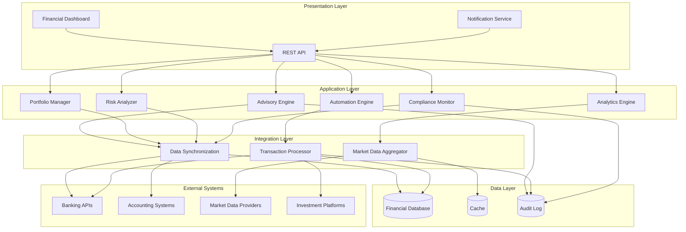

# Design Document: Enterprise CIO Agent

## Overview

The Enterprise CIO Agent is an intelligent financial automation and advisory system that combines real-time data integration, automated transaction processing, portfolio management, risk assessment, and strategic advisory capabilities. The system is designed as a modular, event-driven architecture that can scale to handle enterprise-level financial operations while maintaining security, compliance, and auditability.

The system operates as an autonomous agent that continuously monitors financial data, executes automated workflows, analyzes market conditions, and provides actionable recommendations to enterprise stakeholders. It integrates with existing financial infrastructure through standardized APIs and provides a unified interface for financial operations and insights.

## Architecture

The system follows a layered, event-driven architecture with clear separation of concerns:



### Architectural Principles

1. **Event-Driven**: The system reacts to financial events, market changes, and scheduled triggers
2. **Modular**: Each component has a single responsibility and can be developed/deployed independently
3. **Scalable**: Horizontal scaling for data processing and analysis workloads
4. **Secure**: Defense-in-depth security with encryption, authentication, and authorization at every layer
5. **Auditable**: Complete audit trail of all operations for compliance and forensics
6. **Resilient**: Fault-tolerant design with retry mechanisms and graceful degradation

## Components and Interfaces

### 1. Data Synchronization Service

**Responsibility**: Integrate with external financial systems and maintain synchronized data

**Key Operations**:
- `connect(system_config) -> Connection`: Establish secure connection to external system
- `authenticate(credentials) -> AuthToken`: Authenticate using OAuth2, API keys, or certificates
- `sync_data(source, interval) -> SyncResult`: Pull data from external systems
- `validate_data(data) -> ValidationResult`: Verify data integrity and completeness
- `retry_failed_sync(sync_id, backoff_strategy) -> SyncResult`: Retry failed synchronizations

**Data Structures**:
```
Connection {
    system_id: string
    system_type: enum (BANK, ACCOUNTING, INVESTMENT)
    auth_token: AuthToken
    last_sync: timestamp
    status: enum (CONNECTED, DISCONNECTED, ERROR)
}

SyncResult {
    sync_id: string
    timestamp: timestamp
    records_synced: integer
    errors: list<Error>
    status: enum (SUCCESS, PARTIAL, FAILED)
}
```

### 2. Transaction Processor

**Responsibility**: Execute and manage financial transactions with validation and error handling

**Key Operations**:
- `schedule_transaction(transaction, schedule) -> TransactionID`: Schedule a future transaction
- `execute_transaction(transaction) -> ExecutionResult`: Execute a transaction immediately
- `verify_funds(account, amount) -> boolean`: Check if sufficient funds are available
- `request_approval(transaction, approvers) -> ApprovalRequest`: Request manual approval
- `rollback_transaction(transaction_id) -> RollbackResult`: Reverse a completed transaction

**Data Structures**:
```
Transaction {
    transaction_id: string
    type: enum (PAYMENT, TRANSFER, INVESTMENT, WITHDRAWAL)
    from_account: Account
    to_account: Account
    amount: decimal
    currency: string
    scheduled_time: timestamp
    status: enum (PENDING, APPROVED, EXECUTED, FAILED, ROLLED_BACK)
    approval_required: boolean
    approvers: list<User>
}

ExecutionResult {
    transaction_id: string
    executed_at: timestamp
    status: enum (SUCCESS, FAILED)
    confirmation_code: string
    error_message: optional<string>
}
```

### 3. Portfolio Manager

**Responsibility**: Track and analyze investment portfolio performance

**Key Operations**:
- `calculate_metrics(portfolio) -> PortfolioMetrics`: Compute performance metrics
- `track_asset_performance(asset) -> AssetMetrics`: Monitor individual asset performance
- `assess_impact(market_event, portfolio) -> ImpactAnalysis`: Evaluate market event impact
- `recommend_rebalancing(portfolio, target_allocation) -> RebalancingPlan`: Generate rebalancing recommendations
- `get_portfolio_snapshot(timestamp) -> PortfolioSnapshot`: Get historical portfolio state

**Data Structures**:
```
Portfolio {
    portfolio_id: string
    assets: list<Asset>
    total_value: decimal
    currency: string
    last_updated: timestamp
}

PortfolioMetrics {
    roi: decimal
    volatility: decimal
    sharpe_ratio: decimal
    beta: decimal
    alpha: decimal
    max_drawdown: decimal
    period: TimePeriod
}

Asset {
    asset_id: string
    type: enum (STOCK, BOND, COMMODITY, CRYPTO, REAL_ESTATE)
    quantity: decimal
    current_price: decimal
    purchase_price: decimal
    purchase_date: timestamp
    market_value: decimal
}
```

### 4. Risk Analyzer

**Responsibility**: Assess and monitor financial risks across the enterprise

**Key Operations**:
- `evaluate_portfolio_risk(portfolio, risk_profile) -> RiskAssessment`: Assess overall portfolio risk
- `detect_threshold_breach(metric, threshold) -> Alert`: Identify when risk exceeds limits
- `run_scenario_analysis(scenarios, portfolio) -> ScenarioResults`: Model different market conditions
- `identify_concentration_risk(portfolio) -> ConcentrationReport`: Find over-concentrated positions
- `calculate_var(portfolio, confidence_level) -> ValueAtRisk`: Compute Value at Risk

**Data Structures**:
```
RiskProfile {
    risk_tolerance: enum (CONSERVATIVE, MODERATE, AGGRESSIVE)
    max_volatility: decimal
    max_drawdown: decimal
    concentration_limits: map<AssetType, decimal>
}

RiskAssessment {
    overall_risk_score: decimal (0-100)
    risk_level: enum (LOW, MEDIUM, HIGH, CRITICAL)
    risk_factors: list<RiskFactor>
    recommendations: list<string>
    assessed_at: timestamp
}

RiskFactor {
    factor_type: enum (MARKET, CREDIT, LIQUIDITY, OPERATIONAL, CONCENTRATION)
    severity: decimal (0-10)
    description: string
    affected_assets: list<Asset>
}
```

### 5. Advisory Engine

**Responsibility**: Generate strategic financial recommendations and insights

**Key Operations**:
- `generate_report(report_type, parameters) -> AdvisoryReport`: Create advisory reports
- `analyze_opportunities(market_data, portfolio) -> list<Opportunity>`: Identify investment opportunities
- `prioritize_recommendations(recommendations) -> list<Recommendation>`: Rank recommendations by impact
- `compare_strategies(strategies) -> ComparisonMatrix`: Compare multiple strategic options
- `explain_recommendation(recommendation_id) -> Explanation`: Provide detailed rationale

**Data Structures**:
```
AdvisoryReport {
    report_id: string
    generated_at: timestamp
    report_type: enum (WEEKLY, MONTHLY, QUARTERLY, AD_HOC)
    executive_summary: string
    recommendations: list<Recommendation>
    market_analysis: MarketAnalysis
    portfolio_review: PortfolioReview
}

Recommendation {
    recommendation_id: string
    title: string
    description: string
    priority: enum (LOW, MEDIUM, HIGH, URGENT)
    expected_impact: decimal
    confidence_score: decimal (0-1)
    rationale: string
    supporting_data: map<string, any>
    action_items: list<string>
}
```

### 6. Budget Forecaster

**Responsibility**: Plan budgets and forecast cash flows

**Key Operations**:
- `analyze_spending_patterns(historical_data) -> SpendingAnalysis`: Identify spending trends
- `forecast_cashflow(time_period, assumptions) -> CashFlowForecast`: Project future cash flows
- `detect_budget_variance(actual, budget) -> VarianceReport`: Compare actual vs planned spending
- `model_scenarios(scenarios) -> list<BudgetScenario>`: Create budget scenarios
- `recommend_budget(constraints, goals) -> BudgetPlan`: Generate budget recommendations

**Data Structures**:
```
CashFlowForecast {
    forecast_id: string
    period: TimePeriod
    projected_inflows: list<CashFlow>
    projected_outflows: list<CashFlow>
    net_cashflow: decimal
    confidence_interval: (decimal, decimal)
    assumptions: list<string>
}

BudgetPlan {
    budget_id: string
    fiscal_period: TimePeriod
    categories: list<BudgetCategory>
    total_budget: decimal
    contingency_reserve: decimal
}

BudgetCategory {
    category_name: string
    allocated_amount: decimal
    spent_amount: decimal
    remaining: decimal
    variance_percentage: decimal
}
```

### 7. Compliance Monitor

**Responsibility**: Ensure regulatory compliance and enforce policies

**Key Operations**:
- `validate_transaction(transaction, rules) -> ComplianceResult`: Check transaction compliance
- `prevent_violation(transaction) -> BlockResult`: Block non-compliant transactions
- `generate_compliance_report(period) -> ComplianceReport`: Create regulatory reports
- `update_rules(new_rules) -> UpdateResult`: Apply updated compliance rules
- `audit_trail(entity_id, time_range) -> AuditTrail`: Retrieve compliance audit records

**Data Structures**:
```
ComplianceRule {
    rule_id: string
    rule_type: enum (REGULATORY, INTERNAL_POLICY)
    description: string
    validation_logic: function
    severity: enum (WARNING, ERROR, CRITICAL)
    effective_date: timestamp
}

ComplianceResult {
    compliant: boolean
    violations: list<Violation>
    warnings: list<Warning>
    checked_at: timestamp
}

Violation {
    rule_id: string
    rule_description: string
    severity: enum (WARNING, ERROR, CRITICAL)
    details: string
    remediation_steps: list<string>
}
```

### 8. Market Intelligence Service

**Responsibility**: Aggregate and analyze market data and trends

**Key Operations**:
- `fetch_market_data(sources) -> MarketData`: Retrieve real-time market data
- `identify_opportunities(criteria, market_data) -> list<Opportunity>`: Find investment opportunities
- `analyze_investment(investment_candidate) -> InvestmentAnalysis`: Perform fundamental/technical analysis
- `track_indicators(indicators) -> IndicatorValues`: Monitor macroeconomic indicators
- `detect_trends(market_data, time_window) -> list<Trend>`: Identify market trends

**Data Structures**:
```
MarketData {
    timestamp: timestamp
    asset_prices: map<string, decimal>
    volumes: map<string, integer>
    indices: map<string, decimal>
    commodities: map<string, decimal>
    forex_rates: map<string, decimal>
}

Opportunity {
    opportunity_id: string
    asset: Asset
    opportunity_type: enum (BUY, SELL, HOLD)
    expected_return: decimal
    risk_score: decimal
    time_horizon: TimePeriod
    analysis: InvestmentAnalysis
}

InvestmentAnalysis {
    fundamental_score: decimal
    technical_score: decimal
    valuation_metrics: map<string, decimal>
    growth_prospects: string
    risks: list<string>
    recommendation: enum (STRONG_BUY, BUY, HOLD, SELL, STRONG_SELL)
}
```

### 9. Notification Service

**Responsibility**: Deliver alerts and notifications to stakeholders

**Key Operations**:
- `send_alert(alert, channels) -> DeliveryResult`: Send alert through multiple channels
- `escalate_notification(alert, escalation_path) -> EscalationResult`: Escalate critical alerts
- `configure_preferences(user, preferences) -> ConfigResult`: Set user notification preferences
- `send_summary(summary, recipients) -> DeliveryResult`: Send daily summary reports
- `track_delivery(notification_id) -> DeliveryStatus`: Check notification delivery status

**Data Structures**:
```
Alert {
    alert_id: string
    severity: enum (INFO, WARNING, CRITICAL)
    title: string
    message: string
    created_at: timestamp
    source: string
    action_required: boolean
    action_deadline: optional<timestamp>
    related_entities: list<string>
}

NotificationChannel {
    channel_type: enum (EMAIL, SMS, IN_APP, WEBHOOK)
    address: string
    enabled: boolean
    priority: integer
}

NotificationPreferences {
    user_id: string
    channels: list<NotificationChannel>
    alert_thresholds: map<string, decimal>
    quiet_hours: optional<TimeRange>
    summary_frequency: enum (DAILY, WEEKLY, NONE)
}
```

### 10. Analytics Engine

**Responsibility**: Provide data analysis and learning capabilities

**Key Operations**:
- `analyze_outcomes(decisions, results) -> OutcomeAnalysis`: Evaluate historical decision quality
- `identify_patterns(data, pattern_type) -> list<Pattern>`: Discover patterns in financial data
- `adapt_model(feedback, model_id) -> UpdatedModel`: Refine models based on feedback
- `calculate_confidence(prediction) -> decimal`: Compute confidence scores for predictions
- `train_model(training_data, model_type) -> Model`: Train predictive models

**Data Structures**:
```
OutcomeAnalysis {
    analysis_id: string
    period: TimePeriod
    decisions_analyzed: integer
    success_rate: decimal
    insights: list<string>
    model_adjustments: list<ModelAdjustment>
}

Pattern {
    pattern_id: string
    pattern_type: enum (SEASONAL, CYCLICAL, TREND, ANOMALY)
    description: string
    confidence: decimal
    occurrences: list<timestamp>
    predictive_value: decimal
}

Model {
    model_id: string
    model_type: enum (FORECASTING, CLASSIFICATION, OPTIMIZATION)
    version: string
    accuracy_metrics: map<string, decimal>
    last_trained: timestamp
    parameters: map<string, any>
}
```

## Data Models

### Core Entities

**Account**
```
Account {
    account_id: string (primary key)
    account_type: enum (CHECKING, SAVINGS, INVESTMENT, CREDIT)
    institution: string
    account_number: string (encrypted)
    balance: decimal
    currency: string
    last_updated: timestamp
    status: enum (ACTIVE, FROZEN, CLOSED)
}
```

**User**
```
User {
    user_id: string (primary key)
    email: string (unique)
    role: enum (ADMIN, CFO, ANALYST, VIEWER)
    permissions: list<Permission>
    notification_preferences: NotificationPreferences
    created_at: timestamp
    last_login: timestamp
}
```

**AuditEntry**
```
AuditEntry {
    entry_id: string (primary key)
    timestamp: timestamp
    user_id: string
    action: string
    entity_type: string
    entity_id: string
    changes: map<string, any>
    ip_address: string
    success: boolean
}
```

### Relationships

- A Portfolio contains multiple Assets
- A Transaction references two Accounts (from and to)
- An Alert is associated with one or more Users
- A Recommendation belongs to an AdvisoryReport
- An AuditEntry references a User and an entity
- A ComplianceRule applies to Transactions

### Data Storage Strategy

- **Relational Database**: Core financial data, accounts, users, transactions (PostgreSQL)
- **Time-Series Database**: Market data, portfolio metrics, performance history (InfluxDB)
- **Document Store**: Advisory reports, analysis results, unstructured data (MongoDB)
- **Cache**: Real-time market data, frequently accessed metrics (Redis)
- **Audit Log**: Immutable audit trail (append-only storage)

## Data Flow Examples

### Example 1: Automated Transaction Execution

1. Automation Engine checks scheduled transactions
2. Transaction Processor verifies funds availability
3. Compliance Monitor validates against rules
4. If approved: Transaction Processor executes via Banking API
5. Result logged to Audit Log
6. Notification Service sends confirmation
7. Portfolio Manager updates if investment transaction

### Example 2: Risk Alert Generation

1. Market Intelligence Service detects significant price movement
2. Portfolio Manager calculates impact on portfolio
3. Risk Analyzer evaluates against risk thresholds
4. If threshold breached: Alert created
5. Notification Service escalates to risk managers
6. Advisory Engine incorporates into next report

### Example 3: Advisory Report Generation

1. Advisory Engine triggered on schedule
2. Fetches data from Portfolio Manager, Risk Analyzer, Market Intelligence
3. Analytics Engine provides pattern insights
4. Recommendations generated and prioritized
5. Report compiled with visualizations
6. Notification Service delivers to executives
7. Report stored in Document Store


## Correctness Properties

A property is a characteristic or behavior that should hold true across all valid executions of a system—essentially, a formal statement about what the system should do. Properties serve as the bridge between human-readable specifications and machine-verifiable correctness guarantees.

### Property 1: Authentication Security

*For any* connection attempt to an external financial system, authentication with valid credentials should succeed and authentication with invalid credentials should fail.

**Validates: Requirements 1.1**

### Property 2: Data Validation Consistency

*For any* financial data payload or transaction, validation should reject incomplete or malformed data and accept well-formed data that satisfies all rules.

**Validates: Requirements 1.2, 7.1**

### Property 3: Synchronization Timing

*For any* configured synchronization interval, data sync operations should occur within the specified interval and never exceed 15 minutes.

**Validates: Requirements 1.3**

### Property 4: Exponential Backoff Retry

*For any* failed synchronization operation, retry attempts should follow exponential backoff pattern and each failure should be logged.

**Validates: Requirements 1.4**

### Property 5: Transaction Execution Timing

*For any* scheduled transaction, execution should occur within the specified time window from the scheduled time.

**Validates: Requirements 2.1**

### Property 6: Funds Verification

*For any* transaction, if the source account has insufficient funds, the transaction should be rejected before execution.

**Validates: Requirements 2.2**

### Property 7: Approval Enforcement

*For any* transaction marked as requiring approval, the transaction should not execute until all required approvers have authorized it.

**Validates: Requirements 2.5**

### Property 8: Audit Trail Completeness

*For any* transaction, security event, or compliance check, an audit entry should be created containing timestamp, user, action, and outcome.

**Validates: Requirements 2.4, 10.5**

### Property 9: Portfolio Metrics Calculation

*For any* portfolio with known asset values and historical prices, calculated metrics (ROI, volatility, Sharpe ratio) should match the standard financial formulas for these metrics.

**Validates: Requirements 3.1**

### Property 10: Asset Contribution Invariant

*For any* portfolio, the sum of individual asset contributions to portfolio return should equal the total portfolio return.

**Validates: Requirements 3.3**

### Property 11: Rebalancing Convergence

*For any* portfolio and target allocation, following the rebalancing recommendations should move the portfolio closer to the target allocation.

**Validates: Requirements 3.5**

### Property 12: Threshold Alert Generation

*For any* monitored metric (portfolio value, risk exposure, budget variance) that exceeds its configured threshold, an alert should be generated with appropriate severity.

**Validates: Requirements 3.2, 4.2, 6.5**

### Property 13: Risk Profile Compliance

*For any* portfolio and risk profile, if the portfolio violates any risk limit (volatility, concentration, drawdown), the risk assessment should flag it as non-compliant.

**Validates: Requirements 4.1, 4.4**

### Property 14: Scenario Consistency

*For any* portfolio and market scenario, the scenario analysis results should be consistent with the input assumptions (e.g., if scenario assumes 10% market drop, portfolio value should decrease).

**Validates: Requirements 4.3**

### Property 15: Risk-Adjusted Return Calculation

*For any* investment opportunity, the risk-adjusted return should be calculated as (expected return - risk-free rate) / volatility.

**Validates: Requirements 4.5**

### Property 16: Recommendation Prioritization

*For any* set of recommendations, those with higher impact scores and urgency levels should be ranked before those with lower scores.

**Validates: Requirements 5.3**

### Property 17: Recommendation Completeness

*For any* generated recommendation, it should include rationale, supporting data, confidence score, and action items.

**Validates: Requirements 5.4, 11.4**

### Property 18: Strategy Comparison Completeness

*For any* set of multiple strategic options, a comparison matrix should be generated showing pros, cons, and key metrics for each option.

**Validates: Requirements 5.5**

### Property 19: Forecast Period Coverage

*For any* cash flow forecast request with a specified time period, the forecast should include projections covering the entire requested period.

**Validates: Requirements 6.2**

### Property 20: Budget Variance Detection

*For any* budget category where actual spending differs from planned spending by more than the threshold percentage, a variance should be identified and explained.

**Validates: Requirements 6.3**

### Property 21: Scenario Differentiation

*For any* two budget scenarios with different assumptions, the resulting budget allocations or forecasts should differ in a way consistent with the assumption changes.

**Validates: Requirements 6.4**

### Property 22: Compliance Violation Blocking

*For any* transaction that violates a compliance rule, the transaction should be blocked from execution and compliance personnel should be notified.

**Validates: Requirements 7.2**

### Property 23: Regulatory Record Completeness

*For any* transaction or operation requiring regulatory reporting, all required fields for that report type should be captured and stored.

**Validates: Requirements 7.3**

### Property 24: Rule Update Propagation

*For any* compliance rule update, all operations performed after the update timestamp should be validated against the new rules, not the old rules.

**Validates: Requirements 7.5**

### Property 25: Opportunity Identification

*For any* market condition that matches the defined investment criteria, an opportunity should be identified and added to the opportunities list.

**Validates: Requirements 8.2**

### Property 26: Investment Analysis Completeness

*For any* investment candidate, the analysis should include both fundamental scores and technical scores along with valuation metrics.

**Validates: Requirements 8.3**

### Property 27: Portfolio Context in Opportunities

*For any* identified investment opportunity, the comparison should reference current portfolio holdings and indicate how the opportunity relates to existing positions.

**Validates: Requirements 8.4**

### Property 28: Dashboard Metrics Completeness

*For any* generated financial dashboard, it should include all required real-time metrics: portfolio value, cash flow, risk score, and recent alerts.

**Validates: Requirements 9.1**

### Property 29: Report Export Round-Trip

*For any* financial report, exporting to a format (PDF, Excel, CSV) and then parsing the key data should preserve the essential financial figures and structure.

**Validates: Requirements 9.4**

### Property 30: Authentication Enforcement

*For any* request to access financial data, if the request lacks valid authentication credentials, access should be denied.

**Validates: Requirements 10.1**

### Property 31: Role-Based Access Control

*For any* user and resource, the user should only be able to access the resource if their role includes the required permission for that resource.

**Validates: Requirements 10.2**

### Property 32: MFA Requirement for Sensitive Operations

*For any* operation classified as sensitive (large transactions, configuration changes, user management), multi-factor authentication should be required.

**Validates: Requirements 10.3**

### Property 33: Data Encryption Verification

*For any* financial data stored or transmitted, the data should be encrypted using approved algorithms (AES-256 for rest, TLS 1.3 for transit).

**Validates: Requirements 10.4**

### Property 34: Model Improvement with Training Data

*For any* predictive model, as more training data is added, the model's accuracy metrics should improve or remain stable (not degrade).

**Validates: Requirements 11.1**

### Property 35: Pattern Incorporation

*For any* identified pattern in financial data, subsequent predictions or analyses should reflect the pattern (e.g., if seasonal pattern identified, forecasts should show seasonality).

**Validates: Requirements 11.2**

### Property 36: Feedback Integration

*For any* recommendation that receives negative user feedback, the likelihood of generating similar recommendations in the future should decrease.

**Validates: Requirements 11.5**

### Property 37: Multi-Channel Notification Delivery

*For any* alert and user with multiple configured notification channels, the alert should be delivered to all enabled channels.

**Validates: Requirements 12.1**

### Property 38: Critical Event Escalation

*For any* event classified as critical, notifications should be escalated according to the escalation path (e.g., if primary recipient doesn't acknowledge within timeout, escalate to secondary).

**Validates: Requirements 12.2**

### Property 39: Notification Preference Respect

*For any* user with configured notification preferences (thresholds, channels, quiet hours), notifications should respect these preferences.

**Validates: Requirements 12.3**

### Property 40: Action-Required Notification Completeness

*For any* notification that requires user action, the notification should clearly specify the required action and the deadline for completion.

**Validates: Requirements 12.5**


## Error Handling

### Error Categories

**1. Integration Errors**
- External API failures (timeouts, rate limits, service unavailable)
- Authentication failures
- Data format mismatches
- Network connectivity issues

**Handling Strategy**:
- Exponential backoff retry for transient failures
- Circuit breaker pattern to prevent cascading failures
- Fallback to cached data when available
- Alert administrators for persistent failures

**2. Transaction Errors**
- Insufficient funds
- Invalid account information
- Compliance violations
- Duplicate transaction detection

**Handling Strategy**:
- Validate before execution (fail fast)
- Atomic transactions with rollback capability
- Clear error messages to users
- Automatic notification to relevant stakeholders

**3. Data Validation Errors**
- Missing required fields
- Invalid data types or formats
- Business rule violations
- Constraint violations

**Handling Strategy**:
- Validate at system boundaries
- Provide detailed validation error messages
- Reject invalid data before processing
- Log validation failures for analysis

**4. Security Errors**
- Authentication failures
- Authorization violations
- Encryption/decryption failures
- Suspicious activity detection

**Handling Strategy**:
- Immediate access denial
- Security event logging
- Alert security team for critical events
- Temporary account lockout for repeated failures

**5. System Errors**
- Database connection failures
- Out of memory conditions
- Service crashes
- Configuration errors

**Handling Strategy**:
- Graceful degradation (continue with reduced functionality)
- Health checks and automatic service restart
- Comprehensive error logging
- Failover to backup systems

### Error Response Format

All errors should follow a consistent structure:

```
ErrorResponse {
    error_code: string
    error_message: string
    error_category: enum (INTEGRATION, TRANSACTION, VALIDATION, SECURITY, SYSTEM)
    timestamp: timestamp
    request_id: string
    details: map<string, any>
    remediation_steps: list<string>
}
```

### Logging Strategy

- **ERROR level**: All errors that prevent operation completion
- **WARN level**: Recoverable issues, degraded performance
- **INFO level**: Successful operations, state changes
- **DEBUG level**: Detailed execution flow for troubleshooting

All logs should include:
- Timestamp
- Request ID for tracing
- User ID (if applicable)
- Component name
- Structured data for parsing

## Testing Strategy

### Dual Testing Approach

The system requires both unit testing and property-based testing for comprehensive coverage:

**Unit Tests**: Focus on specific examples, edge cases, and integration points
- Specific transaction scenarios (successful payment, failed payment, etc.)
- Edge cases (zero balance, maximum transaction amount, etc.)
- Error conditions (network timeout, invalid credentials, etc.)
- Integration between components

**Property-Based Tests**: Verify universal properties across all inputs
- Generate random portfolios, transactions, market data
- Verify properties hold for all generated inputs
- Minimum 100 iterations per property test
- Catch edge cases that manual test design might miss

### Property-Based Testing Configuration

**Testing Library Selection**:
- Python: Hypothesis
- TypeScript/JavaScript: fast-check
- Java: jqwik
- Go: gopter

**Test Configuration**:
- Minimum 100 iterations per property test
- Configurable seed for reproducibility
- Shrinking enabled to find minimal failing examples
- Timeout of 30 seconds per property test

**Test Tagging**:
Each property-based test must be tagged with a comment referencing the design property:

```python
# Feature: enterprise-cio-agent, Property 6: Funds Verification
@given(transactions=transaction_strategy(), accounts=account_strategy())
def test_insufficient_funds_rejected(transactions, accounts):
    # Test implementation
```

### Test Coverage Requirements

**Component-Level Testing**:
- Each component should have unit tests for core operations
- Mock external dependencies
- Test error handling paths
- Verify logging and audit trail creation

**Integration Testing**:
- Test data flow between components
- Verify end-to-end workflows
- Test with realistic data volumes
- Validate external API integrations (using test environments)

**Property-Based Testing**:
- One property test per correctness property (40 properties total)
- Each property test validates the universal behavior
- Properties should be tested close to implementation (catch errors early)

### Test Data Strategy

**Generators for Property-Based Tests**:
- Portfolio generator: random assets, quantities, prices
- Transaction generator: random amounts, accounts, types
- Market data generator: realistic price movements
- User generator: random roles, permissions
- Compliance rule generator: various rule types

**Test Data Characteristics**:
- Cover full range of valid inputs
- Include boundary values
- Generate invalid inputs for negative testing
- Ensure data relationships are maintained (e.g., transaction amount ≤ account balance for valid tests)

### Continuous Testing

**Pre-Commit**:
- Run fast unit tests
- Linting and code formatting
- Type checking

**CI Pipeline**:
- Full unit test suite
- Property-based tests (100 iterations)
- Integration tests
- Security scanning
- Code coverage reporting (target: 80%+)

**Nightly**:
- Extended property-based tests (1000+ iterations)
- Performance testing
- Load testing
- Security penetration testing

### Testing Anti-Patterns to Avoid

❌ **Don't**: Write too many unit tests for behavior covered by properties
✅ **Do**: Use property tests for universal behavior, unit tests for specific examples

❌ **Don't**: Test implementation details
✅ **Do**: Test observable behavior and contracts

❌ **Don't**: Mock everything in integration tests
✅ **Do**: Use real components where possible, mock only external systems

❌ **Don't**: Write property tests with fewer than 100 iterations
✅ **Do**: Configure minimum 100 iterations to ensure good coverage

### Success Criteria

The testing strategy is successful when:
- All 40 correctness properties have corresponding property-based tests
- Property tests run with minimum 100 iterations each
- Unit tests cover edge cases and error conditions
- Integration tests validate end-to-end workflows
- Test suite runs in under 10 minutes in CI
- Code coverage exceeds 80%
- No critical bugs escape to production

